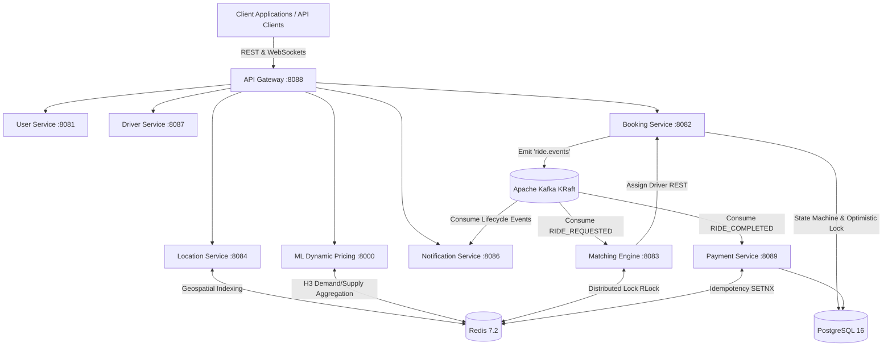

# RidePulse 🚗

**RidePulse** is a high-concurrency, event-driven distributed ride-hailing backend platform built with **Java 21**, **Spring Boot 3.3**, **Spring Cloud**, **Apache Kafka (KRaft)**, **Redis 7.2**, **PostgreSQL 16**, and **Python / FastAPI**.

It features real-time driver geospatial tracking, heuristic-based dispatch matching with distributed concurrency locking, dynamic surge pricing via Uber H3 spatial indexing, and fault-tolerant idempotent payment settlements.

---

## 🏗️ System Architecture



For detailed in-depth service mechanics, state machines, and API specifications, see [docs/SERVICES_WALKTHROUGH.md](docs/SERVICES_WALKTHROUGH.md).

---

## 🌐 Port Reference & Services Matrix

| Service / Container | Port | Tech Stack | Responsibility |
| :--- | :--- | :--- | :--- |
| **API Gateway** | `8088` | Spring Cloud Gateway | Reverse proxy, CORS unification, and unified routing |
| **User Service** | `8081` | Spring Boot, JPA, PostgreSQL | Rider profiles and registration |
| **Booking Service** | `8082` | Spring Boot, JPA, Kafka | Ride lifecycle state machine with `@Version` optimistic locking |
| **Matching Engine** | `8083` | Spring Boot, Redisson, Kafka | Heuristic scoring formula & distributed locking (`RLock`) |
| **Location Service** | `8084` | Spring Boot, Redis GEO, STOMP | Real-time driver GPS ingestion and proximity radius queries |
| **Kafka UI** | `8085` | Provectus Kafka-UI (Docker) | Web console to inspect Kafka topics, partitions & messages |
| **Notification Service**| `8086` | Spring Boot, WebSockets (STOMP) | Real-time client alerts via dedicated STOMP topics |
| **Driver Service** | `8087` | Spring Boot, JPA, PostgreSQL | Driver onboarding and online/offline status management |
| **Payment Service** | `8089` | Spring Boot, JPA, Redis, Kafka | Idempotent transaction settlement via Redis `SETNX` |
| **ML Demand Pricing**| `8000` | Python, FastAPI, Uber H3, Redis | Real-time geospatial demand-to-supply surge calculation |
| **PostgreSQL DB** | `5432` | PostgreSQL 16 (Docker) | Relational persistence store (`ridepulse_db`) |
| **Redis Cache/Locks**| `6379` | Redis 7.2 (Docker) | Ephemeral geo-indexing, locks, and caching |
| **Apache Kafka** | `9092` | Confluent Kafka 7.6 (Docker) | Event bus / messaging backbone in KRaft mode |

---

## ⚙️ Prerequisites

- **Java 21 (LTS)** & **Maven 3.9+**
- **Python 3.10+**
- **Docker & Docker Compose**

---

## 🚀 Quickstart

### 1. Launch Infrastructure
Start PostgreSQL, Redis, Apache Kafka (KRaft mode), and Kafka UI:
```bash
docker compose up -d
```
* **Kafka UI Dashboard**: [http://localhost:8085](http://localhost:8085)

---

### 2. Start the ML Demand & Pricing Service
```bash
cd services/ml-demand-pricing
pip install -r requirements.txt
python -m uvicorn app.main:app --host 0.0.0.0 --port 8000 --reload
```
* **Interactive Swagger Docs**: [http://localhost:8000/docs](http://localhost:8000/docs)

---

### 3. Build & Run Java Microservices
Build the multi-module Maven project from the root folder:
```bash
mvn clean install -DskipTests
```

Launch the Spring Boot applications from your IDE (e.g., IntelliJ IDEA) or terminal:
- `ApiGatewayApplication` (`:8088`)
- `UserServiceApplication` (`:8081`)
- `BookingServiceApplication` (`:8082`)
- `MatchingEngineApplication` (`:8083`)
- `LocationServiceApplication` (`:8084`)
- `NotificationServiceApplication` (`:8086`)
- `DriverServiceApplication` (`:8087`)
- `PaymentServiceApplication` (`:8089`)

---

## 🧪 End-to-End Simulation

Validate the entire distributed ride lifecycle through the API Gateway (`:8088`) with the automated simulation script:

```bash
pip install requests
python simulate_ride_flow.py
```

### Lifecycle Executed:
1. **Rider Registration** (`POST /api/v1/users/register`)
2. **Driver Onboarding** (`POST /api/v1/drivers/register`)
3. **Geospatial Tracking Verification** (`GET /api/v1/locations/nearby`)
4. **H3 Dynamic Surge Estimation** (`POST /api/v1/pricing/estimate`)
5. **Ride Dispatch & Locking** (`POST /api/v1/rides/request` $\rightarrow$ Kafka `RIDE_REQUESTED`)
6. **Ride Completion & Idempotent Payment** (`PUT /api/v1/rides/{id}/complete` $\rightarrow$ Kafka `RIDE_COMPLETED`)

---

## 🛡️ Key Architectural Patterns

- **Distributed Locking**: Redisson `RLock` prevents race conditions, ensuring a driver is never matched to two riders concurrently.
- **Optimistic Concurrency Control**: JPA `@Version` guarantees safe ride state transitions.
- **Idempotent Consumers**: Atomic Redis `SETNX` with a 24-hour TTL prevents duplicate payment processing from at-least-once Kafka deliveries.
- **Geospatial Hexagonal Binning**: Uber H3 (Resolution 7) bins coordinates into ~1.2km radius cells for real-time demand-to-supply surge calculations.
